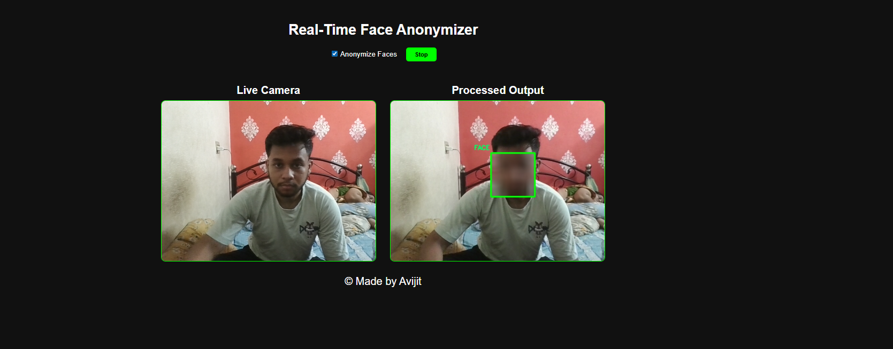
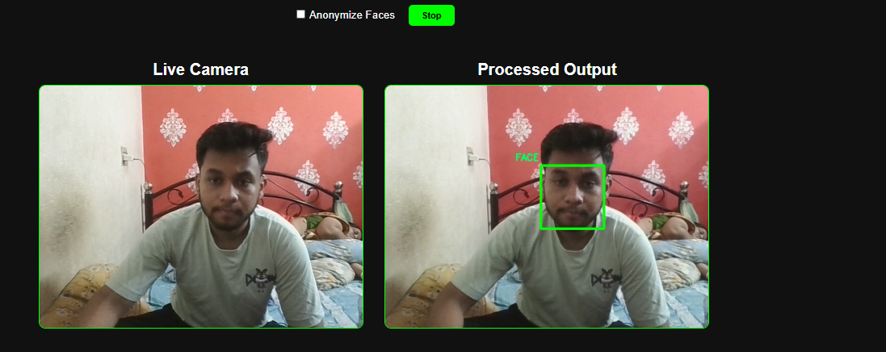

```sh
Face Anonymizer
```

## 🖼️ UI

### Face Anonymizer Preview

  



-----

## Project Overview

This is a simple yet effective **Face Anonymizer** tool created to help developers and content creators protect the privacy of individuals in images and videos. The tool uses **OpenCV** to perform image and video processing and **MediaPipe** for accurate face detection. 🤖 It automatically detects faces in a given input and applies a blur filter, effectively anonymizing the individuals. This is especially useful for creating datasets, sharing research, or publishing content while adhering to privacy standards.

-----

## Technologies Used

  * **OpenCV:** A powerful open-source library for computer vision tasks, used here for image and video manipulation.
  * **MediaPipe:** A machine learning framework from Google that provides fast and accurate pre-built solutions for various tasks, including face detection.
  * **Python:** The core programming language used to build the tool.
  * **HTML, CSS, JavaScript:** Used for the front-end interface, allowing for a web-based demonstration of the tool's functionality.

-----

## Getting Started

Follow these steps to get the project up and running on your local machine.

### Prerequisites

You'll need **Python 3.x** and `pip` installed.

### Installation

1.  **Clone the repository:**

    ```sh
    git clone https://github.com/your-username/face-anonymizer.git
    cd face-anonymizer
    ```

2.  **Install the required dependencies:**

    ```sh
    pip install -r requirements.txt
    ```

### Usage

1.  **Run the application:**

    ```sh
    python main.py
    ```

    This will start a local web server.

2.  **Open your web browser** and navigate to `http://127.0.0.1:8000/anonymize` (or the address shown in the terminal).

3.  **Upload an image or video** using the provided interface to see the face anonymization in action\!

-----

## Project Structure

```
.
├── api/
│   ├── __pycache__/
│   ├── face_ano.ipynb
│   └── main.py
├── face/
├── src/
│   ├── index.html
│   ├── scripts.js
│   └── styles.css
└── requirements.txt
```

  * `api/`: Contains the backend logic for the face anonymization.
  * `face/`: Directory for processing and storing data.
  * `src/`: Contains the front-end code for the web interface.
  * `requirements.txt`: Lists all the necessary Python libraries.